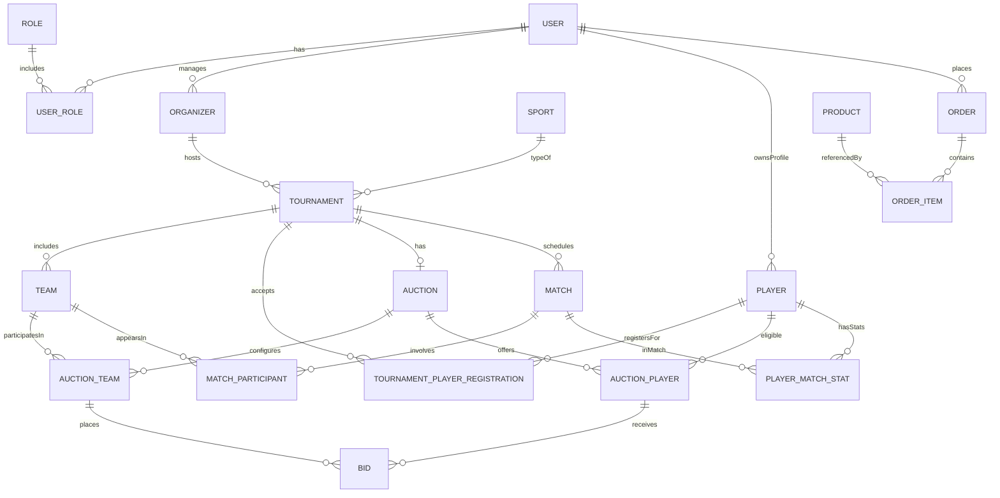
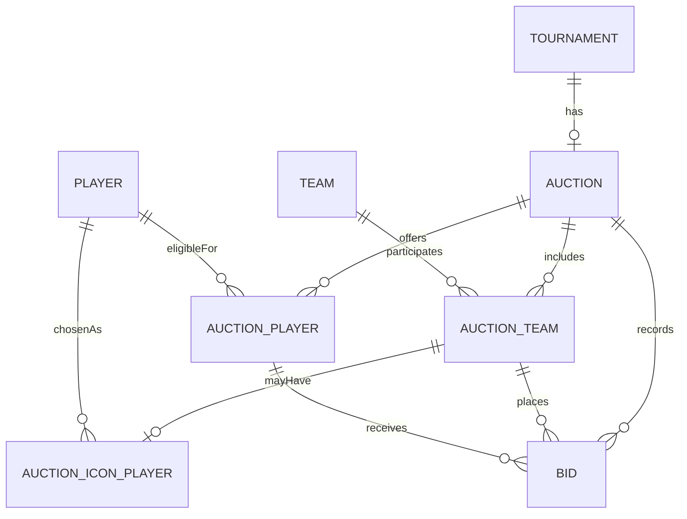
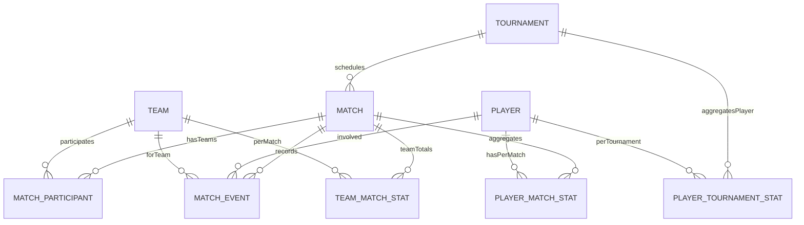

# Database Schema Documentation

## 1. Overview

This document describes the **high-level PostgreSQL schema** for the multi-sport tournament management and auction platform described in:

- `SOW_Auction_Module.md`
- `SOW_Multi_Sport_Tournament_Platform.md`

The schema is designed to:

- Support a **standalone web-based auction module** for tournament organizers (your immediate MVP).
- Integrate cleanly with the **full multi-sport platform**, including live scoring, player statistics, media, e‑commerce, and community features.
- Work well with a **Node.js / Express API** using a single PostgreSQL database.

The schema is intentionally **conceptual / relational** (entities, keys, and relationships). It is not final SQL DDL, but it is designed so DDL can be generated directly from it.

---

## 2. Conventions & Patterns

- **Database**: PostgreSQL.
- **Naming**:
  - Tables use `snake_case`, mostly singular: e.g. `user`, `tournament`, `player_match_stat`.
  - Primary keys: `id` (UUID or bigserial, depending on implementation).
  - Foreign keys: `<entity>_id`, e.g. `user_id`, `tournament_id`.
- **Multi-tenancy**:
  - Multi-tenant at **organizer** and **tournament** level (not separate DBs).
  - Many tables include `organizer_id` and/or `tournament_id` to support scoping, filtering, and row-level permissions.
- **Soft Deletes**:
  - Use `deleted_at TIMESTAMPTZ NULL` on entities that can be logically removed (players, teams, tournaments, etc.).
- **Audit Fields**:
  - Common fields: `created_at`, `updated_at`, `created_by`, `updated_by`.
- **Role Model**:
  - Single `user` table with role mapping through `role` and `user_role`.
  - Player, organizer, team owner, scorer, etc. are modeled as **profiles** linked to `user`.

---

## 3. High-Level Domains

- **Identity & Access**: Users, roles, permissions.
- **Organizers & Subscriptions**: Organizer profiles, subscription plans, billing.
- **Sports, Tournaments & Teams**: Sports catalog, tournaments, venues, teams, team memberships.
- **Players & Registration**: Player profiles, tournament registrations, payment status.
- **Auction Module**: Auctions, auction teams, auction players, icon players, bids, reports.
- **Matches, Scoring & Statistics**: Matches, events, per-match stats, aggregated stats.
- **Media, Streaming & Assets**: Photos, videos, live streams.
- **E‑Commerce & Sponsorship**: Products, orders, payments, sponsorships.
- **Community & Communication**: Posts, comments, reactions, follows, announcements, notifications.
- **System & Integration**: API clients, webhooks, audit logs.

---

## 4. Global ER Overview (Simplified)

> This diagram shows only core entities to keep it readable. Detailed diagrams for auction and statistics are provided later.

---

## 5. Domain: Identity & Access

### 5.1 Tables

- **`user`**
  - Core account: email, password hash, phone, status.
  - Can login and hold one or more roles.
- **`role`**
  - Predefined roles: `super_admin`, `organizer`, `team_owner`, `player`, `scorer`, `spectator`.
- **`user_role`**
  - Join table mapping `user` to `role`.
- **`permission`** (optional, if you want fine-grain)
  - Named permissions like `tournament.create`, `auction.manage`.
- **`role_permission`** (optional)
  - Join table mapping `role` to `permission`.

### 5.2 Key Relationships

- `user` 1–N `user_role` N–1 `role`.
- `role` 1–N `role_permission` N–1 `permission`.
- `user` is linked to other domains:
  - 1–0/1 with `organizer` (if that user is an organizer).
  - 1–0/1 with `player` (if that user has a player profile).
  - 1–N with `team` as `owner_user_id` (team owner / captain).

### 5.3 Notes

- Tokens (JWT) and sessions can be tracked in a separate `user_session` table if you need revocation, but that is orthogonal to core schema.

---

## 6. Domain: Organizers & Subscriptions

### 6.1 Tables

- **`organizer`**
  - `id`, `user_id`, organization name, contact info, region, branding.
- **`subscription_plan`**
  - Definitions like `auction_monthly`, `auction_annual`, `organizer_basic`, `enterprise`.
- **`subscription`**
  - Active subscription instance for an `organizer`.
  - Fields: `organizer_id`, `subscription_plan_id`, start/end dates, status.
- **`payment`**
  - All platform-side payments (organizer subscriptions, marketplace orders, etc.).
  - `user_id`, `organizer_id` (if applicable), `amount`, `currency`, `status`, `payment_gateway`, `external_reference`.
- **`invoice`** (optional)
  - Invoice records linked to `subscription` and `payment`.

### 6.2 Key Relationships

- `user` 1–N `organizer`.
- `organizer` 1–N `subscription`.
- `subscription_plan` 1–N `subscription`.
- `subscription` 1–N `invoice`.
- `payment` may reference:
  - `subscription` (organizer billing).
  - `order` (marketplace).

---

## 7. Domain: Sports, Tournaments & Teams

### 7.1 Tables

- **`sport`**
  - Master list: Cricket, Volleyball, Football, Basketball, Badminton, Kabaddi, etc.
- **`competition_level`**
  - District, State, National, School, College, Corporate, Community, Open, etc.
- **`age_category`**
  - U13, U16, U19, Open, etc.
- **`venue`**
  - Ground/stadium with address, geo info.
- **`tournament`**
  - `id`, `organizer_id`, `sport_id`, `competition_level_id`, `age_category_id`, name, description, dates, format (knockout, league, pools, hybrid), status.
  - Config flags for auction usage, registration type (free/paid), rules, branding, sponsorship.
- **`tournament_stage`** / **`group`** (optional but useful)
  - Groups/pools, league stage vs playoffs.
- **`team`**
  - Team within a specific tournament.
  - `id`, `tournament_id`, name, short_name, logo, `owner_user_id` (team owner/captain), status.
- **`team_membership`**
  - Player’s membership in a team for a given tournament.
  - `team_id`, `player_id`, `tournament_id`, role (captain, vice-captain, player), is_icon_player (for visibility), status.

### 7.2 Key Relationships

- `sport` 1–N `tournament`.
- `organizer` 1–N `tournament`.
- `competition_level` 1–N `tournament`.
- `age_category` 1–N `tournament`.
- `venue` 1–N `match` (linked later).
- `tournament` 1–N `team`.
- `team` 1–N `team_membership` N–1 `player`.
- `tournament` 1–N `team_membership` (scoping memberships to the event).

### 7.3 Notes

- This design keeps **team identity per tournament**, which aligns with the auction SOW where teams are tournament-specific.

---

## 8. Domain: Players & Registration

### 8.1 Tables

- **`player`**
  - Core profile across tournaments and sports.
  - `id`, `user_id` (nullable for non-app users), name, DOB, gender, primary_sport_id, district, state, country, bio, profile_photo_url.
- **`player_document`**
  - Uploaded documents: ID proof, certificates.
- **`tournament_player_registration`**
  - A player’s registration for a specific tournament.
  - `player_id`, `tournament_id`, `registration_type` (free/paid), `payment_status` (unpaid, pending, paid, rejected), status (pending, approved, rejected), category/position (batsman, bowler, setter, etc.), optional stats snapshot, optional uploaded receipt URL, organizer notes.

### 8.2 Key Relationships

- `user` 1–0/1 `player`.
- `player` 1–N `tournament_player_registration`.
- `tournament` 1–N `tournament_player_registration`.
- `tournament_player_registration` 1–N `player_document` (if you attach docs at registration level).

### 8.3 Notes

- Auction eligibility is based on **approved** `tournament_player_registration` records and their `payment_status`, which feeds into `auction_player`.

---

## 9. Domain: Auction Module

This module is central for your first implementation (Node.js / Express + PostgreSQL).

### 9.1 Tables

- **`auction`**
  - Auction configuration per tournament.
  - Fields:
    - `id`, `tournament_id` (unique), `organizer_id`.
    - `status`: draft, scheduled, in_progress, completed, cancelled.
    - `points_per_team`.
    - `team_size_min`, `team_size_max` (or fixed size).
    - `icon_player_enabled` (boolean).
    - `bid_increment_type` (fixed, step, custom) + config fields.
    - `scheduled_at`, `started_at`, `completed_at`.
- **`auction_team`**
  - View of `team` within auction context, adding budget and live info.
  - `team_id`, `auction_id`, `starting_points`, `points_remaining`, `points_spent`, `max_players`, `auto_bid_enabled` (future).
- **`auction_icon_player`**
  - Icon player assigned to a team for tournament (if feature enabled).
  - `auction_id`, `team_id`, `player_id`, `assigned_at`.
- **`auction_player`**
  - Player entry in the auction pool.
  - `auction_id`, `player_id`, `tournament_player_registration_id`, `base_price_points`, `category` (batsman, bowler, allrounder, etc.), `status` (scheduled, sold, unsold, withdrawn), `sold_to_team_id`, `final_bid_points`.
- **`bid`**
  - Bid history for every player auction.
  - `id`, `auction_id`, `auction_player_id`, `auction_team_id`, `bidder_user_id`, `bid_points`, `created_at`, `is_winning_snapshot` (for easy lookup), `sequence`.
- **`auction_session_event`** (optional but useful)
  - Timeline of events: auction started, paused, resumed, player opened, player closed, etc.
- **`auction_report`**
  - Metadata for generated reports (PDF/Excel/CSV).
  - `auction_id`, file URLs, `generated_at`, `format`, `summary_json`.

### 9.2 Relationships

- `tournament` 1–0/1 `auction`.
- `auction` 1–N `auction_team` N–1 `team`.
- `auction` 1–N `auction_player` N–1 `player` (via registration).
- `auction_team` 1–0/1 `auction_icon_player` N–1 `player`.
- `auction` 1–N `bid` N–1 `auction_team`.
- `auction_player` 1–N `bid`.
- `auction` 1–N `auction_report`.

### 9.3 Auction ER Diagram

### 9.4 Post-Auction Roster Sync

- When `auction` reaches `completed`:
  - For each `auction_player` with `status = sold`:
    - Create or update `team_membership` with:
      - `team_id = sold_to_team_id`
      - `player_id`
      - `tournament_id`
  - Ensure `auction_icon_player` entries also exist as `team_membership` with `is_icon_player = true`.

This makes the auction module feed **team rosters** used by scoring and statistics.

---

## 10. Domain: Matches, Scoring & Statistics

### 10.1 Tables

- **`season`** (optional)
  - Logical grouping across tournaments; can be omitted initially.
- **`match`**
  - Core match entity for any sport.
  - Fields:
    - `id`, `tournament_id`, `sport_id`, `venue_id`, `stage_id`, `scheduled_at`, `started_at`, `completed_at`.
    - Status: scheduled, in_progress, completed, abandoned.
    - Sport-specific configuration (overs for cricket, sets for volleyball, halves for football) as structured columns or JSON.
- **`match_participant`**
  - Teams participating in a match.
  - `match_id`, `team_id`, `is_home`, `is_away`, `toss_winner_team_id` (for cricket), final scores.
- **`match_event`**
  - Fine-grained scoring events.
  - Generic structure with `event_type` + `data` (JSONB) to support different sports:
    - Example types: `cricket_ball`, `football_goal`, `volleyball_point`, etc.
    - Common fields: `match_id`, `team_id`, `player_id` (actor), `timestamp`, `sequence`.
- **`player_match_stat`**
  - Aggregated per-player metrics per match, derived from `match_event`.
  - Contains sport-specific columns like:
    - Cricket: runs, balls, fours, sixes, wickets, overs, maidens, catches.
    - Football: goals, assists, shots, passes, cards.
    - Volleyball: points, blocks, aces, digs.
- **`team_match_stat`**
  - Per-team, per-match totals.
- **`player_tournament_stat`**
  - Aggregated per-player per-tournament stats.
- **`player_geographic_stat`**
  - Rollup across district, state, national, and competition types (district tournament, corporate, school, etc.).

### 10.2 Relationships

- `tournament` 1–N `match`.
- `match` 1–N `match_participant` N–1 `team`.
- `match` 1–N `match_event`.
- `player` 1–N `match_event` (actor or target).
- `player` 1–N `player_match_stat` N–1 `match`.
- `team` 1–N `team_match_stat` N–1 `match`.
- `player` 1–N `player_tournament_stat` N–1 `tournament`.

### 10.3 Matches & Stats ER Diagram

---

## 11. Domain: Media, Streaming & Assets

### 11.1 Tables

- **`media_asset`**
  - Any uploaded media (photo, video, document).
  - Fields: `id`, `url`, `type` (image, video, pdf), `mime_type`, `size_bytes`, `uploaded_by`, `created_at`.
- **`entity_media`**
  - Generic mapping of media to any entity.
  - `media_asset_id`, `entity_type`, `entity_id`, `role` (profile_photo, highlight, banner, etc.).
- **`live_stream`**
  - Live streaming configuration for a match or tournament.
  - `id`, `match_id` (nullable), `tournament_id` (nullable), `provider` (YouTube, Facebook, custom), `stream_key`, `stream_url`, `status`.

### 11.2 Relationships

- `media_asset` 1–N `entity_media`.
- `match` 1–N `entity_media` (as match highlights).
- `tournament` 1–N `entity_media` (as banners, promo images).
- `team` and `player` can also be linked via `entity_media`.
- `match` 1–0/1 `live_stream`.
- `tournament` 1–N `live_stream` (e.g., tournament-level streams).

---

## 12. Domain: E‑Commerce & Sponsorship

### 12.1 Tables

- **`product_category`**
  - Categories like Bats, Balls, Jerseys, Shoes.
- **`product`**
  - Marketplace item: `id`, `product_category_id`, name, description, price, currency, stock_keeping_unit, images.
- **`order`**
  - E‑commerce order: `id`, `user_id`, `organizer_id` (if linked to a tournament), `status`, totals, shipping info.
- **`order_item`**
  - `order_id`, `product_id`, quantity, unit_price, total_price.
- **`shipping_address`**
  - Addresses, referenced by `order`.
- **`payment`**
  - Already described above; reused here to link to `order_id`.

### 12.2 Sponsorship

- **`sponsor`**
  - Sponsor entity: organization name, logo, contact details.
- **`sponsorship_package`**
  - Predefined packages (gold, silver, bronze) with benefits.
- **`sponsorship_assignment`**
  - Links sponsors to tournaments or teams:
  - `sponsor_id`, `tournament_id` (nullable), `team_id` (nullable), `sponsorship_package_id`, term, amount.

### 12.3 Relationships

- `product_category` 1–N `product`.
- `user` 1–N `order`.
- `order` 1–N `order_item` N–1 `product`.
- `order` 1–0/1 `shipping_address`.
- `payment` N–1 `order`.
- `sponsor` 1–N `sponsorship_assignment`.
- `tournament` 1–N `sponsorship_assignment`.
- `team` 1–N `sponsorship_assignment`.

---

## 13. Domain: Community & Communication

### 13.1 Tables

- **`post`**
  - User-generated content, can be linked to tournaments, matches, teams, or players.
- **`comment`**
  - Comments on posts.
- **`reaction`**
  - Reactions (like, love, etc.) on posts or comments.
- **`follow`**
  - Follows between user and another entity:
  - `follower_user_id`, `entity_type`, `entity_id`.
- **`announcement`**
  - Official organizer or system announcements, optionally linked to tournaments.
- **`message`**
  - Direct or group messages (in-app chat).
- **`notification`**
  - Delivered notifications with `user_id`, type, payload, read status.
- **`notification_preference`**
  - Per-user notification channel and type preferences.

### 13.2 Relationships

- `user` 1–N `post`, `comment`, `reaction`.
- `post` 1–N `comment`, `reaction`.
- `comment` 1–N `reaction`.
- `user` 1–N `follow` (as follower).
- Target entities (player, team, tournament) are referenced via `entity_type` and `entity_id` in `follow` and `post`.
- `user` 1–N `notification`, 1–1 `notification_preference`.

---

## 14. Domain: System & Integration

### 14.1 Tables

- **`api_client`**
  - Third-party clients with API keys.
- **`api_key`**
  - Keys linked to `api_client` with scopes and expiry.
- **`webhook`**
  - Outbound webhooks configured by clients or organizers (e.g., “on auction completed”).
- **`webhook_event`**
  - Delivery logs for webhook attempts.
- **`audit_log`**
  - System-wide audit trail: `entity_type`, `entity_id`, `action`, `actor_user_id`, `before`, `after`, `created_at`.

### 14.2 Relationships

- `api_client` 1–N `api_key`.
- `webhook` 1–N `webhook_event`.
- `user` 1–N `audit_log` (as actor).

---

## 15. How This Supports the Auction-First MVP

For the **initial Auction Module in Node.js / Express + PostgreSQL**, the minimum required tables are:

- Identity: `user`, `role`, `user_role`.
- Organizers: `organizer`, `subscription_plan`, `subscription`, `payment`.
- Core tournaments: `sport`, `competition_level`, `age_category`, `tournament`, `team`, `team_membership`.
- Players & registration: `player`, `tournament_player_registration`, `player_document` (optional).
- Auction: `auction`, `auction_team`, `auction_icon_player`, `auction_player`, `bid`, `auction_report`, `auction_session_event` (optional).

Everything else (matches, stats, media, marketplace, community) can be implemented in later phases without breaking changes, because:

- Core IDs (`user`, `player`, `tournament`, `team`) are stable and used consistently.
- Auction output (`team_membership`) is already in the shape required for scoring and statistics.

---

## 16. Summary

This schema:

- **Unifies** the auction SOW and the multi-sport platform SOW in a single relational model.
- Separates concerns into clear domains (identity, tournaments, auction, matches, media, commerce, community).
- Allows you to **ship the auction module first** while keeping a clean path toward full tournament management, live scoring, statistics, and beyond.

As you implement the Node.js / Express APIs, you can generate migration files from this documentation and refine column-level details (types, indexes, constraints) without changing the overall structure.

